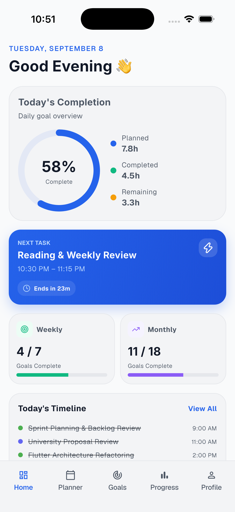
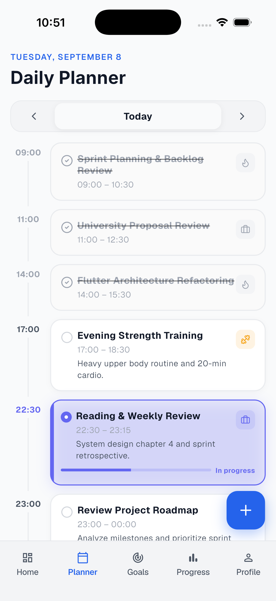
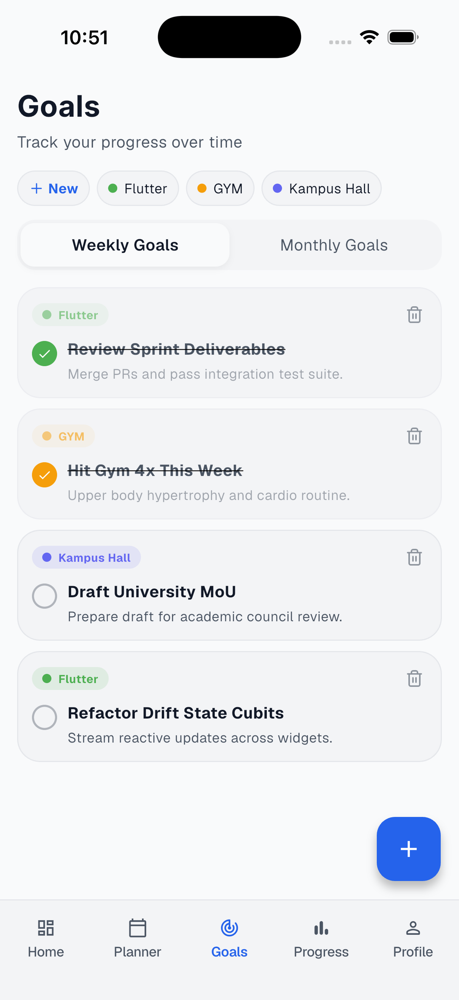
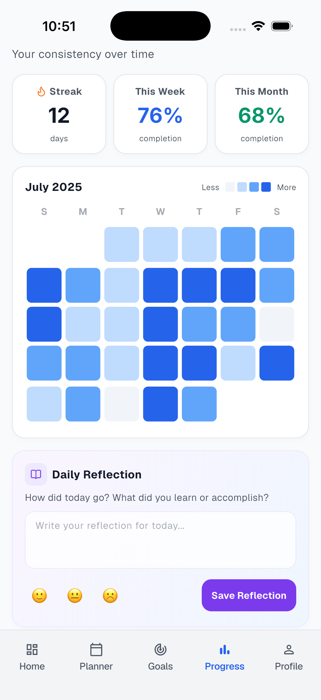
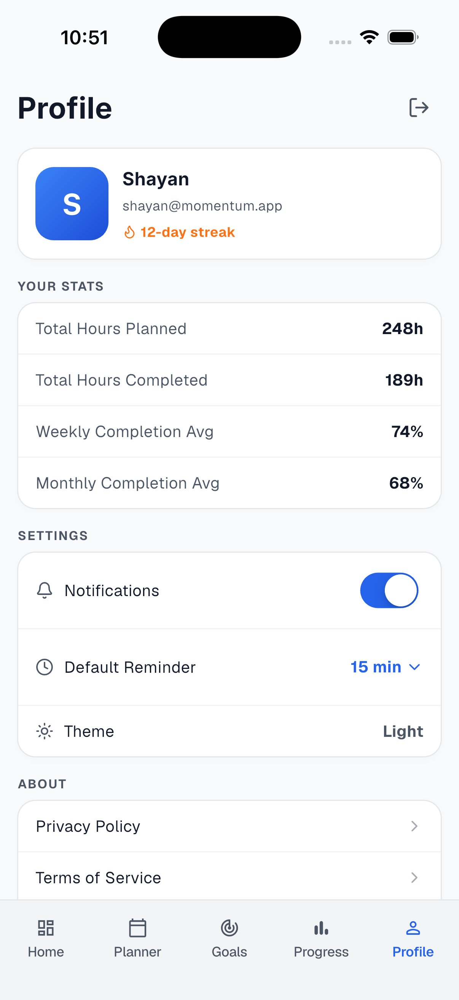

# ⚡ Momentum — Personal Productivity & Habit Tracker

> A modern, reactive productivity app built with **Flutter**, **Firebase**, and **BLoC Architecture**, engineered to help users organize daily tasks, track long-term goals, and visualize personal growth.

[](https://flutter.dev)
[](https://dart.dev)
[](https://firebase.google.com)
[](https://bloclibrary.dev)
[-teal?style=for-the-badge)](https://drift.simonbinder.eu)
[](#project-status)

---

> [!NOTE]
> 🚧 **Work in Progress**: This project is under active development. Core features such as authentication, schedule management, goal tracking, and cloud synchronization are functional, with advanced offline-first syncing and AI-driven insights currently being integrated.

---

## 📱 Screenshots

<p align="center">
  
  
  
  
  
</p>

| **Home** | **Planner** | **Goals** | **Progress** | **Profile** |
| :---: | :---: | :---: | :---: | :---: |
| Daily agenda, quick streaks, & productivity snapshot | Hourly timeline scheduling & task categorization | Milestone setting & category-based goal tracking | Completion analytics & productivity charts | Profile stats, reminders, & theme toggles |

---

## 🌟 Key Features

- **📊 Intelligent Daily Dashboard**: At-a-glance view of daily schedules, streak counts, completion rates, and planned vs. completed hours.
- **⏱️ Interactive Time-Block Planner**: Hour-by-hour timeline scheduling to organize tasks with custom duration, start/end times, and category tags.
- **🎯 Categorized Goal Management**: Set, update, and monitor long-term goals segmented into domains like *Work*, *Health*, *Learning*, and *Rest*.
- **📈 Progress & Habit Analytics**: Visual breakdown of productive output, performance trends, and consistency streaks over time.
- **🎨 Custom Design System & Dark Mode**: Responsive design with Geist and Inter typography, fluid animations, and real-time light/dark theme switching.
- **🔒 Firebase Authentication & Cloud Sync**: Secure authentication (Email & Google Sign-In) with real-time Firestore database replication.

---

## 🏗️ Architecture & Engineering Highlights

This codebase is structured with **Clean Architecture** principles and separation of concerns, designed to be scalable, testable, and maintainable.

```
lib/
├── blocs/                # BLoC / Cubit state management (Auth, Tasks, Goals, Categories, Profile)
├── core/                 # Core utilities, database abstractions, & shared models
│   ├── db/               # Local SQLite database implementation using Drift ORM
│   └── models/           # Domain entity models and type definitions
├── models/               # Application data models & JSON serialization
├── repositories/         # Repository pattern layer (Firestore & Auth abstractions)
├── router/               # Declarative routing with GoRouter & Auth guards
├── services/             # Firebase infrastructure, logging, & fault handlers
├── ui/                   # Presentation layer
│   ├── screens/          # Feature screens (Home, Planner, Goals, Progress, Profile)
│   └── widgets/          # Reusable, atomic UI components
└── main.dart             # Dependency injection root & app bootstrap
```

### 1. **Layered Architecture & Separation of Concerns**
- **Presentation Layer**: Built with atomic and modular Flutter widgets. Feature screens isolate local view state (using `_state.dart` controllers) while delegating global mutations to BLoCs.
- **Business Logic Layer (`flutter_bloc`)**: Utilizes event-driven `Bloc` and state-driven `Cubit` instances to maintain a predictable, unidirectional data flow (UDF). App-level providers ensure reactive updates across views.
- **Repository Pattern**: `MomentumRepository` and `AuthRepository` abstract backend data sources (Cloud Firestore, Firebase Auth, and local databases), decoupling the UI from data retrieval logic.
- **Data Persistence Strategy**:
  - **Cloud Firestore**: Real-time reactive document streams for seamless multi-device synchronization.
  - **Drift (SQLite)**: High-performance type-safe relational database with DAOs and schema migrations for robust local caching.

### 2. **Declarative Navigation & Route Guards**
- Configured with `go_router` utilizing a `ShellRoute` for smooth bottom navigation persistence across primary screens.
- Reactive route guards via `GoRouterRefreshBloc`, ensuring immediate redirects between authenticated and unauthenticated states.

### 3. **Modern Dart Practices & Code Generation**
- Strict type-safety with `freezed` and `json_serializable` for immutable models and seamless JSON parsing.
- Linted under Flutter recommended best practices for high code quality and consistency.

---

## 🛠️ Technology Stack

| Domain | Technology |
| :--- | :--- |
| **Framework** | [Flutter](https://flutter.dev) (SDK ^3.10.7) |
| **Language** | [Dart](https://dart.dev) (3.x) |
| **State Management** | [`flutter_bloc`](https://pub.dev/packages/flutter_bloc) (BLoC & Cubit) |
| **Routing** | [`go_router`](https://pub.dev/packages/go_router) |
| **Backend as a Service** | [Firebase](https://firebase.google.com) (Auth, Cloud Firestore) |
| **Local Database** | [Drift](https://drift.simonbinder.eu) (SQLite) |
| **Code Generation** | `build_runner`, `freezed`, `json_serializable`, `drift_dev` |
| **Icons & Typography** | Lucide Icons (`flutter_lucide`), Google Fonts (Inter, Geist) |

---

## 🚀 Getting Started

### Prerequisites
- [Flutter SDK](https://docs.flutter.dev/get-started/install) installed.
- Dart SDK 3.x compatible environment.
- A configured Firebase project (with Firestore and Authentication enabled).

### Setup Instructions

1. **Clone the repository**:
   ```bash
   git clone https://github.com/3SyedShayan/momentum.git
   cd momentum
   ```

2. **Install dependencies**:
   ```bash
   flutter pub get
   ```

3. **Run code generation** (for Drift and serialization):
   ```bash
   dart run build_runner build --delete-conflicting-outputs
   ```

4. **Firebase Configuration**:
   Ensure `firebase_options.dart` is populated with your Firebase project credentials using the FlutterFire CLI:
   ```bash
   flutterfire configure
   ```

5. **Launch the application**:
   ```bash
   flutter run
   ```

---

## 📌 Project Status

This repository is an ongoing project showcasing production-grade Flutter architecture for mobile productivity software.

**Upcoming Milestones:**
- [ ] Offline-first sync engine between Drift SQLite and Firestore.
- [ ] AI-powered smart scheduling and routine suggestions via `firebase_ai`.
- [ ] Push notifications & daily reminders system.
- [ ] Extended weekly/monthly report exports.

---

## 👤 Author

**Syed Shayan**
- Portfolio / GitHub: [@3SyedShayan](https://github.com/3SyedShayan)
